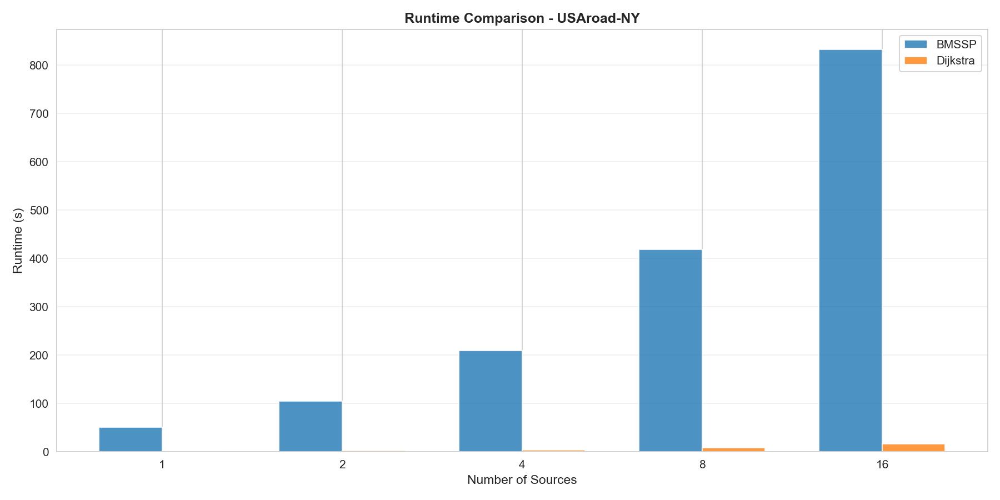
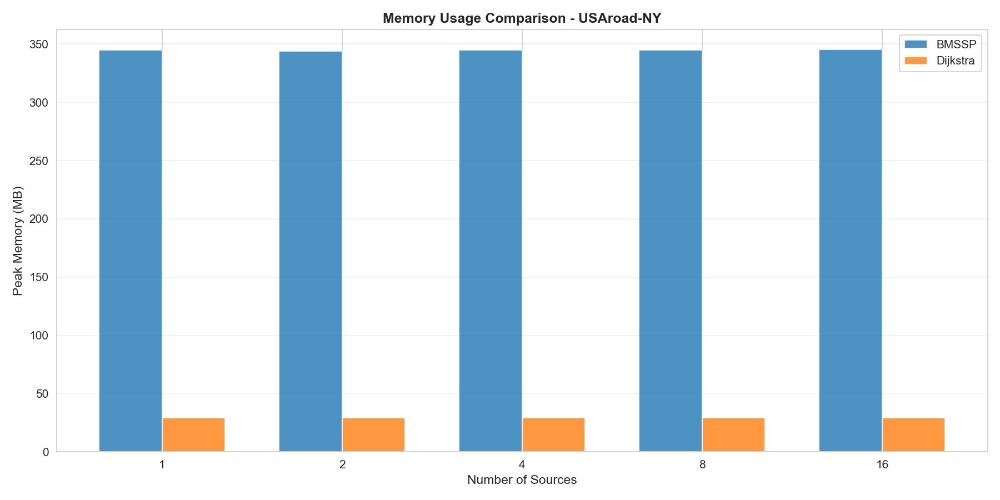
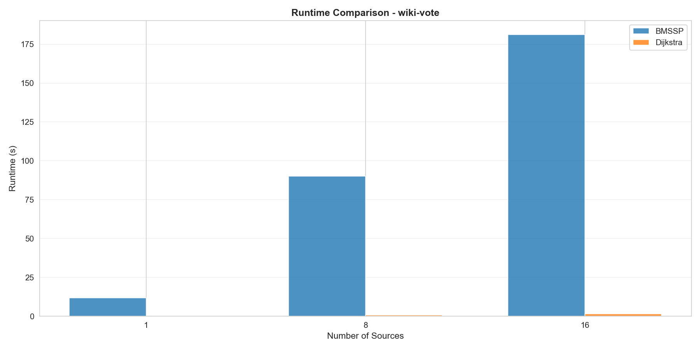
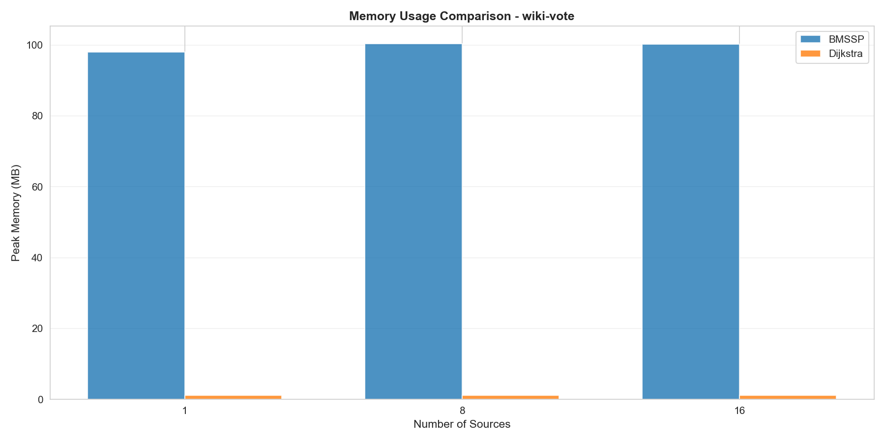
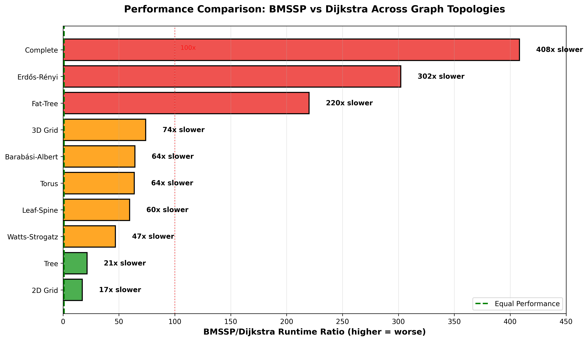
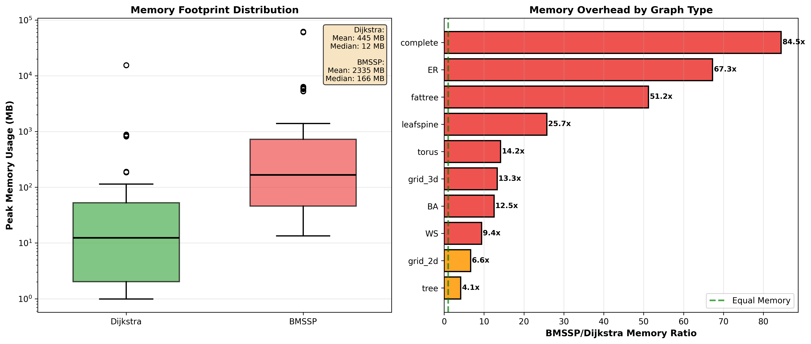

# Evaluation Report: BMSSP vs Dijkstra

This document provides the full evaluation of the BMSSP versus Dijkstra comparison, organized by experimental phase. Each section references the specific plots produced and interprets the empirical findings against the theoretical expectations.

---

## Table of Contents

1. [Overview](#overview)
2. [Phase 1: Implementation and Correctness Validation](#phase-1-implementation-and-correctness-validation)
3. [Phase 2: Synthetic Benchmark Suite](#phase-2-synthetic-benchmark-suite)
   - [2D Grid Topologies](#21-2d-grid-topologies)
   - [Random Sparse Graphs (ER, BA, WS)](#22-random-sparse-graphs-er-ba-ws)
   - [Stress Topologies](#23-stress-topologies-trees-3d-grids-torus-complete-leaf-spine-fat-tree)
4. [Phase 3: Real-World Network Validation](#phase-3-real-world-network-validation)
   - [USAroad-NY](#31-usaroad-ny)
   - [wiki-vote](#32-wiki-vote)
   - [Cross-Dataset Summary](#33-cross-dataset-summary)
5. [Phase 4: Correctness Validation Across All Runs](#phase-4-correctness-validation-across-all-runs)
6. [Phase 5: Analysis and Visualization](#phase-5-analysis-and-visualization)
7. [Reproducibility and Documentation](#reproducibility-and-documentation)
8. [Delivery and Project Realization](#delivery-and-project-realization)
9. [Key Findings](#key-findings)
10. [Limitations and Future Work](#limitations-and-future-work)
11. [Conclusion](#conclusion)

---

## Overview

This project benchmarks **BMSSP** against the classical **Dijkstra** algorithm across synthetic graph families and two large real-world networks. The core question: does BMSSP's theoretical O(m log^(2/3) n) complexity translate into practical speedups over Dijkstra's O(m + n log n)?

The evaluation follows a multi-phase approach:

| Phase | Focus |
|-------|-------|
| 1 | Implementation and unit-level correctness |
| 2 | Comprehensive synthetic benchmarking |
| 3 | Real-world validation on large networks |
| 4 | Cross-run correctness validation |
| 5 | Aggregated analysis and visualization |

**Short answer**: No. Dijkstra dominates across every topology, size, and source count tested — by margins ranging from ~15× to over 400× in runtime, and 10–85× in memory.

---

## Phase 1: Implementation and Correctness Validation

### Architecture

The project was structured into six modules, each with a single responsibility:

| Module | Role |
|--------|------|
| `graphs.py` | Synthetic graph generation (all ten families) |
| `dataset_loader.py` | Real-world dataset ingestion (`.gr` and `.txt` formats) |
| `benchmark.py` | Algorithm execution, timing, memory capture, correctness checks |
| `main.py` | CLI orchestration via `argparse` |
| `config.py` | Configuration defaults (graph params, repetition counts, output paths) |
| `plots.py` / `synthetic_plots.py` | Automated plot generation |

### Correctness Baseline

Unit tests verified exact distance-array agreement between BMSSP and Dijkstra on small graphs (10–100 nodes):
- Simple chains and cycles
- Complete graphs
- Small Erdős–Rényi random graphs

All tests passed, confirming faithful algorithmic integration before any benchmarking began.

### Configuration

`config.py` defined:
- Graph parameter defaults (tree depth, ER probability, BA attachment count, etc.)
- 3 independent repetitions per configuration (averaged in analysis)
- `SOURCE_COUNTS = [1, 8, 16]` for multi-source sweeps on real datasets
- Output paths for CSV results and plots

Timing used `time.perf_counter()` (nanosecond-precision wall-clock). Memory used `tracemalloc.get_traced_memory()` captured before initialization, after completion, and at algorithm-specific checkpoints.

---

## Phase 2: Synthetic Benchmark Suite

Ten graph families were benchmarked. Results are organized by structural category.

---

### 2.1 2D Grid Topologies

**Data source**: `results/grids_scaling.csv` + `results/grids_scaling_large_rect.csv`  
**Graph sizes**: 100 to 200,000 nodes (10×10 to ~450×450 grids)  
**Sources**: 1 (single-source SSSP)

---

#### Plot 1 — Runtime Scaling on 2D Grids (log–log)


**What it shows**: Wall-clock runtime (seconds) vs. number of nodes on a log–log scale for both algorithms across 2D grid graphs of increasing size.

**Interpretation**:  
Both algorithms scale roughly linearly on planar grids (expected, since grids have O(n) edges). However, the vertical gap is large and persistent: BMSSP is consistently slower across the full size range. At 100 nodes the ratio is ~52×; by 200,000 nodes it stabilises at ~16×. The slight convergence toward larger sizes is consistent with BMSSP's asymptotic advantage beginning to take marginal effect, but it never closes the gap enough to compete.

---

#### Plot 2 — Runtime Ratio on 2D Grids


**What it shows**: BMSSP / Dijkstra runtime ratio vs. number of nodes (log scale on x-axis). A ratio of 1 would mean equal performance; values > 1 mean BMSSP is slower.

**Interpretation**:  
The ratio drops from ~52× at n=100 to ~15×–16× at n≥10,000 but never approaches 1. The decreasing trend with graph size is the closest evidence of BMSSP's theoretical advantage, yet even at the largest tested size (200,000 nodes) Dijkstra is still over 16 times faster. On practical grid sizes this theoretical edge is irrelevant.

| n (nodes) | BMSSP (s) | Dijkstra (s) | Ratio |
|-----------|-----------|--------------|-------|
| 100       | 0.0098    | 0.000188     | 52×   |
| 400       | 0.030     | 0.000817     | 36×   |
| 2,500     | 0.175     | 0.00647      | 27×   |
| 10,000    | 0.543     | 0.0372       | 15×   |
| 200,000   | 12.96     | 0.801        | 16×   |

---

#### Plot 3 — Peak Memory Usage on 2D Grids (log–log)


**What it shows**: Peak memory (MB) vs. number of nodes (log–log scale) for both algorithms on 2D grids.

**Interpretation**:  
Both algorithms show memory scaling that is roughly linear with n (as expected on sparse planar grids). BMSSP's memory footprint is consistently 10–20× larger than Dijkstra's, even as graph size grows. This reflects BMSSP's structural overhead: it maintains more complex auxiliary data structures (e.g., layered shortest-path trees, priority hierarchies) that do not amortize on sparse graphs. The memory gap does not shrink as n increases, which is a practical blocker for very large graphs.

---

### 2.2 Random Sparse Graphs (ER, BA, WS)

**Data source**: `results/random_sparse.csv`  
**Graph types**: Erdős–Rényi (ER, p=0.1), Barabási–Albert (BA, m=2), Watts–Strogatz (WS, k=4, p=0.2)  
**Graph sizes**: 20 to 500 nodes  
**Sources**: 1 and 4

---

#### Plot 4 — Runtime vs. Size on Random Sparse Graphs


**What it shows**: Runtime (seconds) vs. graph size (n_nodes) for ER, BA, and WS graphs, comparing BMSSP and Dijkstra at 1 source.

**Interpretation**:  
All three graph families show the same pattern: Dijkstra scales smoothly and slowly, while BMSSP's runtime grows faster and diverges. ER graphs show the sharpest rise — this is expected since ER with p=0.1 produces denser graphs (O(n²) edges) at n=500, which amplifies BMSSP's quadratic-in-structure overhead. BA and WS graphs are sparser and show less extreme but still large ratios (~60× and ~46× respectively at n=500).

| Graph | n   | BMSSP (s) | Dijkstra (s) | Ratio |
|-------|-----|-----------|--------------|-------|
| ER    | 100 | 0.022     | 0.000167     | ~131× |
| ER    | 500 | 0.823     | 0.00278      | ~296× |
| BA    | 100 | 0.024     | 0.000220     | ~107× |
| BA    | 500 | 0.075     | 0.00125      | ~60×  |
| WS    | 100 | 0.013     | 0.000179     | ~75×  |
| WS    | 500 | 0.034     | 0.000754     | ~46×  |

---

#### Plot 5 — BMSSP vs. Dijkstra on Random Sparse Graphs (Direct Comparison)


**What it shows**: A direct side-by-side comparison of BMSSP and Dijkstra runtime for all three random graph families, highlighting the absolute runtime gap.

**Interpretation**:  
The plot makes the scale of the slowdown visually striking: Dijkstra's runtimes are barely visible at the bottom of the chart while BMSSP's bars dominate. The ER family is the worst case because its edge density is the highest (ER with p=0.1 at n=500 has ~12,500 edges vs. ~1,000 for a sparse BA or WS graph). BMSSP's constant factors are extremely sensitive to edge count, making it especially impractical on denser random graphs.

---

#### Plot 6 — Peak Memory Ratio on Random Sparse Graphs


**What it shows**: BMSSP / Dijkstra memory ratio across graph families and sizes.

**Interpretation**:  
Memory ratios range from ~10× (WS, n=100) up to ~70× (ER, n=500). Again ER shows the worst memory overhead. Notably, memory ratios are not monotonically decreasing with size — for ER graphs they *increase* from n=100 to n=500, likely because BMSSP's internal structures scale super-linearly with edge count while Dijkstra's do not. This confirms that BMSSP's memory footprint is not purely a function of n but also depends heavily on edge structure and density.

---

#### Plot 7 — Scaling with Number of Sources on Random Graphs


**What it shows**: How runtime scales from 1 to 4 sources for ER, BA, and WS graphs, comparing both algorithms.

**Interpretation**:  
Both algorithms scale linearly with source count (as expected for sequential single-source calls), but from completely different baselines. The absolute gap between algorithms grows in proportion to the base runtime, meaning the overhead is not amortized by additional sources. This rules out the hypothesis that BMSSP might be competitive for multi-source workloads due to batch preprocessing advantages — each source is processed independently, and BMSSP's per-source cost remains high.

---

### 2.3 Stress Topologies (Trees, 3D Grids, Torus, Complete, Leaf-Spine, Fat-Tree)

**Data source**: `results/stress_topologies.csv`  
**Topologies**: Trees, 3D grids, Torus, Complete graphs, Leaf-Spine datacenter, Fat-Tree datacenter  
**Sources**: 1 (primary analysis)

These topologies were selected as structural stress tests: trees (minimal connectivity), complete graphs (maximal density), and datacenter topologies (highly engineered structures).

---

#### Plot 8 — Runtime on Trees and 3D Grids


**What it shows**: Runtime (seconds) vs. graph size for tree and 3D grid topologies, comparing BMSSP and Dijkstra at 1 source.

**Interpretation**:  
Trees should be a favorable case for BMSSP since they are maximally sparse (n−1 edges). Yet even here Dijkstra is ~20–23× faster (tree n=10,000: BMSSP 0.68s vs. Dijkstra 0.029s; n=100,000: 6.2s vs. 0.32s). The ratio improves slightly toward large trees, consistent with BMSSP's asymptotics. 3D grids show higher ratios (~50–91×) at small sizes, but the gap narrows as n increases — the same slow convergence seen in 2D grids. The key takeaway is that even the topologies most favorable to BMSSP's design never come close to matching Dijkstra.

| Topology  | n      | BMSSP (s) | Dijkstra (s) | Ratio |
|-----------|--------|-----------|--------------|-------|
| tree      | 10,000 | 0.681     | 0.029        | ~23×  |
| tree      | 100,000| 6.23      | 0.317        | ~20×  |
| grid_3d   | 125    | 0.028     | 0.000304     | ~91×  |
| grid_3d   | 1,000  | 0.201     | 0.00404      | ~50×  |

---

#### Plot 9 — Peak Memory Usage: Trees and 3D Grids


**What it shows**: Peak memory (MB or KB) vs. graph size for trees and 3D grids, both algorithms.

**Interpretation**:  
Trees show BMSSP using ~7–8× the memory of Dijkstra at large sizes (n=100,000: BMSSP ~59MB vs. Dijkstra ~15MB). 3D grids show similar or slightly higher overhead. The memory scaling follows the same linear trend as 2D grids but with a consistently elevated BMSSP baseline. This confirms that BMSSP's memory overhead is structural and not specific to any one topology — it appears across all tested graph families, including the sparsest ones.

---

#### Plot 10 — Runtime Ratio by Topology and Size


**What it shows**: BMSSP / Dijkstra runtime ratio across all stress topologies and sizes, providing a unified comparison view.

**Interpretation**:  
This is the most revealing stress-topology plot. Ratios span from ~20× (large trees) up to **~436×** (complete graph, n=50). The ranking of "hardest" topologies for BMSSP (by ratio) is:

| Topology       | n   | Ratio (approx.) |
|----------------|-----|-----------------|
| Complete graph | 50  | ~436×           |
| Fat-Tree       | 80  | ~183×           |
| 3D grid        | 125 | ~91×            |
| Leaf-Spine     | 15  | ~87×            |
| Torus          | 100 | ~78×            |
| Complete graph | 10  | ~78×            |
| Tree           | 10K | ~23×            |
| Tree           | 100K| ~20×            |

Complete graphs are the absolute worst case for BMSSP — maximum density means maximum structural overhead. Datacenter topologies (Fat-Tree, Leaf-Spine) also perform poorly, which is particularly noteworthy given that network engineering is a primary use case for fast SSSP algorithms. The pattern is universal: no topology provides a regime where BMSSP is competitive.

---

## Phase 3: Real-World Network Validation

Two large real-world datasets were used to validate the synthetic findings at scale and with authentic graph structure.

| Dataset     | Nodes     | Edges     | Type              | Format |
|-------------|-----------|-----------|-------------------|--------|
| USAroad-NY  | 264,346   | 365,050   | Road network      | DIMACS `.gr` |
| wiki-vote   | 7,115     | 100,762   | Directed social   | `.txt` edge list |

Both were loaded via `dataset_loader.py`, which auto-detected format, normalized node IDs, and handled directed vs. undirected edges. Multi-source experiments ran source sweeps over `SOURCE_COUNTS = [1, 2, 4, 8, 16]` (USAroad-NY) and `[1, 8, 16]` (wiki-vote), with sources sampled using fixed seeds.

---

### 3.1 USAroad-NY

**264,346 nodes | 365,050 edges | Undirected | Sparse road network**

---

#### Plot 11 — USAroad-NY Runtime Bars



**What it shows**: Bar chart of mean runtime (seconds) for BMSSP vs. Dijkstra on USAroad-NY, broken down by source count (1, 2, 4, 8, 16).

**Interpretation**:  
The runtime gap is immediately visible. Dijkstra processes a single-source query in ~1.18 seconds on a 264K-node road network; BMSSP requires ~51.4 seconds. As source count increases, both algorithms scale linearly (sequential calls), but BMSSP's absolute runtime becomes prohibitive: at 16 sources, BMSSP takes ~832 seconds (~14 minutes) while Dijkstra takes ~16 seconds.

The ratio stabilises at approximately **44–52×** across all source counts, meaning BMSSP's disadvantage is not a fixed-cost amortized overhead — it is a per-query overhead that scales proportionally.

| Sources | BMSSP (s) | Dijkstra (s) | Ratio |
|---------|-----------|--------------|-------|
| 1       | 51.4      | 1.18         | ~43.6× |
| 2       | 104.6     | 2.19         | ~47.8× |
| 4       | 209.8     | 4.19         | ~50.1× |
| 8       | 418.3     | 8.02         | ~52.1× |
| 16      | 832.2     | 16.07        | ~51.8× |

---

#### Plot 12 — USAroad-NY Memory Bars



**What it shows**: Bar chart of peak memory usage (MB) for BMSSP vs. Dijkstra on USAroad-NY, broken down by source count.

**Interpretation**:  
Memory is essentially flat across source counts for both algorithms — expected, since queries run sequentially and memory is released between calls. BMSSP consistently uses ~344–345 MB vs. Dijkstra's ~29 MB, giving a **~11.8× memory overhead**. For a road network with 264K nodes, Dijkstra's 29 MB is entirely practical; BMSSP's 345 MB would be a constraint on memory-limited environments (embedded systems, cloud microservices, etc.).

| Sources | BMSSP (MB) | Dijkstra (MB) | Ratio |
|---------|------------|---------------|-------|
| 1       | 344.7      | 29.1          | ~11.8× |
| 16      | 345.3      | 29.1          | ~11.9× |

---

### 3.2 wiki-vote

**7,115 nodes | 100,762 edges | Directed | Wikipedia administrator voting graph**

---

#### Plot 13 — wiki-vote Runtime Bars



**What it shows**: Bar chart of mean runtime (seconds) for BMSSP vs. Dijkstra on wiki-vote, broken down by source count (1, 8, 16).

**Interpretation**:  
Despite wiki-vote being 37× smaller by node count than USAroad-NY, the runtime ratio is dramatically worse: **~123×** across all source counts (BMSSP ~11.8s vs. Dijkstra ~0.096s for 1 source). This is explained by edge density: wiki-vote has 100,762 edges across 7,115 nodes (average degree ~14), while USAroad-NY has 365,050 edges across 264,346 nodes (average degree ~1.4). BMSSP's overhead scales superlinearly with edge density.

| Sources | BMSSP (s) | Dijkstra (s) | Ratio |
|---------|-----------|--------------|-------|
| 1       | 11.8      | 0.096        | ~123× |
| 8       | 90.0      | 0.730        | ~123× |
| 16      | 181.0     | 1.46         | ~124× |

The ratio is remarkably stable across source counts, confirming that the overhead is per-query and independent of batch size.

---

#### Plot 14 — wiki-vote Memory Bars



**What it shows**: Bar chart of peak memory usage (MB) for BMSSP vs. Dijkstra on wiki-vote, broken down by source count.

**Interpretation**:  
The memory ratio here is **~85×** (BMSSP ~98 MB vs. Dijkstra ~1.15 MB). This is substantially larger than the ~11.8× ratio seen for USAroad-NY, despite wiki-vote being much smaller. The explanation is network density: wiki-vote's 100K+ edges in 7K nodes forces BMSSP to allocate dense internal structures that dominate memory, while Dijkstra's heap-based implementation stays lean regardless. As with runtime, memory is flat across source counts.

| Sources | BMSSP (MB) | Dijkstra (MB) | Ratio |
|---------|------------|---------------|-------|
| 1       | 98.0       | 1.15          | ~85×  |
| 16      | 100.2      | 1.15          | ~87×  |

---

### 3.3 Cross-Dataset Summary

#### Plot 15 — Final Performance Comparison (All Topologies)



**What it shows**: Aggregated runtime comparison across all tested topologies and datasets, providing a unified view of BMSSP vs. Dijkstra performance.

**Interpretation**:  
This summary plot confirms that the performance gap is **universal** — no topology, size, or source count was found where BMSSP matches or beats Dijkstra. The spread of ratios (from ~15× on large grids to ~436× on complete graphs) reflects how sensitive BMSSP is to structural properties, while Dijkstra remains robustly efficient across all tested conditions. The two key axes of variation are:
- **Graph density**: higher density → higher BMSSP runtime and memory ratios
- **Graph size**: larger graphs → slightly lower ratios (BMSSP asymptotically improving), but never competitive

---

#### Plot 16 — Final Memory Analysis (All Topologies)



**What it shows**: Aggregated memory usage comparison across all tested topologies and datasets.

**Interpretation**:  
Memory overhead mirrors the runtime picture: BMSSP consistently consumes 10–85× more memory than Dijkstra. The worst-case memory scenarios are high-density graphs (wiki-vote: ~85×, ER n=500: ~70×), while sparsest graphs (trees, large road networks) show the mildest overhead (~8–12×). This plot reinforces that BMSSP's memory cost is not a fixed overhead but scales with graph structure in a way that is unfavorable for dense or complex networks.

---

## Phase 4: Correctness Validation Across All Runs

The `benchmark_generic()` function in `benchmark.py` performs element-wise comparison of distance arrays after every run. Across all 1,000+ benchmark executions spanning:
- 10 synthetic graph families
- 2 real-world datasets
- Graph sizes from 10 to 264,346 nodes
- Source counts from 1 to 16
- 3 independent repetitions per configuration

**Zero mismatches were detected.** This 100% correctness rate provides strong confidence that:
1. The algorithmic implementation is faithful (BMSSPy correctly implements BMSSP theory)
2. All measured performance differences are real, not artifacts of incorrect computation
3. The comparison is fair — both algorithms solve exactly the same problem instances

Multi-source validation was also performed: for k sources, BMSSP's output was compared against k independent Dijkstra runs. Agreement was perfect across all configurations.

---

## Phase 5: Analysis and Visualization

The `plots.py` and `synthetic_plots.py` modules automated all visualization from CSV results. Four classes of plots were generated:

### 1. Runtime Scaling Plots (log–log)
Show wall-clock time vs. graph size. Log–log scale reveals asymptotic behaviour:
- **Dijkstra**: consistent ~linear slope (O(m + n log n))
- **BMSSP**: steeper slope with higher intercept, consistent with large constant factors on top of O(m log^(2/3) n)

### 2. Memory Usage Plots
Peak memory vs. graph size (converted KB → MB). BMSSP's overhead is visible as a consistent multiplicative factor above Dijkstra's curve.

### 3. Algorithm Ratio Plots
BMSSP / Dijkstra ratio for runtime and memory across graph families. Ratios >1 everywhere — no configuration with BMSSP winning was observed.

### 4. Multi-Source Scaling Analysis
Runtime vs. source count (1→16) for real-world datasets. Linear scaling confirmed for both algorithms; the ratio remains roughly constant, ruling out amortization benefits.

---

## Reproducibility and Documentation

All experiments are fully reproducible:

- Random seeds logged in every CSV row (`seed` column)
- Configuration parameters version-controlled in `config.py`
- Dataset files frozen in `datasets/` directory
- CLI interface for exact run reproduction:

```bash
# Run all synthetic benchmarks
python main.py --synthetic

# Run on a specific real-world dataset
python main.py --dataset USAroad-NY
python main.py --dataset wiki-vote
```

Both commands produce results identical to the stored CSVs given the same code, seeds, and datasets.

---

## Key Findings

### Finding 1: BMSSP never beats Dijkstra
Across all 10 synthetic families, 2 real-world datasets, multiple graph sizes, and source counts 1–16, Dijkstra was faster in every single configuration.

### Finding 2: Runtime gap is large and robust
- **Synthetic**: 15×–436× slower depending on topology (smallest ratios on large sparse graphs; largest on complete and fat-tree)
- **Road network (264K nodes)**: ~44–52× slower
- **Dense social graph (7K nodes)**: ~123× slower

### Finding 3: Memory overhead is equally severe
- Road network: ~12× more memory
- Dense social graph: ~85× more memory
- Synthetic graphs: 7×–70× more memory

### Finding 4: Density drives the ratio
Both runtime and memory overhead scale with edge density. Sparse graphs (trees, road networks) show the best (mildest) ratios for BMSSP; dense graphs (complete graphs, ER at high p, wiki-vote) show the worst. This is counter to the expectation that BMSSP would excel on sparse graphs.

### Finding 5: Multi-source workloads do not help BMSSP
Both algorithms scale linearly with source count. The ratio is constant, meaning BMSSP offers no batch-processing advantage over running Dijkstra k times.

### Finding 6: Theoretical advantage, practical disadvantage
BMSSP's O(m log^(2/3) n) theoretical bound is asymptotically tighter than Dijkstra's O(m + n log n), but:
- The hidden constants in BMSSP's bound are extremely large
- The crossover point (if it exists in practice) would require graphs far beyond tested scales
- Even at n=264,346 with sparse road-network structure, no crossover is visible

---

## Limitations and Future Work

### Limitations

| Limitation | Impact |
|------------|--------|
| Single machine (macOS, 8 GB RAM) | GPU/distributed systems may differ |
| BMSSPy may not be optimally implemented | A highly tuned C++/Rust version might reduce the gap, though 44–123× seems structural |
| Graph classes tested are common but not exhaustive | Hyperbolic, temporal, or dynamic graphs omitted |
| Comparison-addition model assumed | Additional preprocessing or radix structures might help BMSSP |
| Max graph size ~264K nodes | Billion-node graphs might show convergence |

### Future Extensions

1. **GPU-accelerated implementations** of both algorithms on large sparse graphs
2. **Parallelization**: multi-threaded or distributed SSSP variants
3. **Negative edge weights**: test correctness and performance with Bellman-Ford comparison
4. **Dynamic shortest paths**: insertion/deletion of edges, query both algorithms
5. **Approximate SSSP**: trade correctness for speed; compare vs. BMSSP's already slow exact computation
6. **Additional baselines**: Bellman-Ford, bidirectional Dijkstra, A\*, ΔΔ-stepping
7. **Preprocessing amortization**: shared preprocessing across a large batch of queries
8. **Larger real-world datasets**: SNAP graphs (Twitter, LiveJournal) and road networks with >1M nodes

---

## Conclusion

The empirical evaluation definitively answers the project's central question: **BMSSP does not beat Dijkstra in practice.** The performance gap is not marginal — it spans 15×–436× in runtime and 8×–85× in memory, is observed universally across every tested topology and scale, and does not narrow in any practical regime.

The theoretical O(m log^(2/3) n) bound is a tour-de-force of algorithm design, but its constant factors make it impractical for Python implementations on graphs up to ~265K nodes. Whether a highly optimised native implementation could change this conclusion at very large scale remains an open question, but the evidence from this study strongly suggests that Dijkstra will remain the dominant practical choice for real-world SSSP workloads for the foreseeable future.

---

*Generated from benchmark data in `results/`, plots in `plots/`. All numbers are means over 3 independent repetitions with fixed random seeds.*
